 linux查询占用端口并Kill进程（记录遇到的端口占用问题）
``` javascript?fancy=2,3&linenums=true
#查看占用端口情况
netstat -anp|grep 8080
#杀死进程
kill -9 10355
```
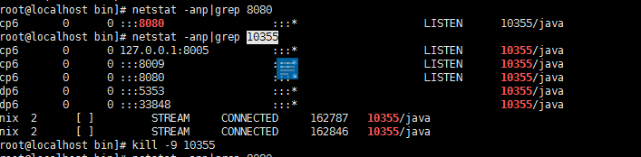
### 安装
我们选择War包的方式进行安装
下载地址：https://jenkins.io/download/
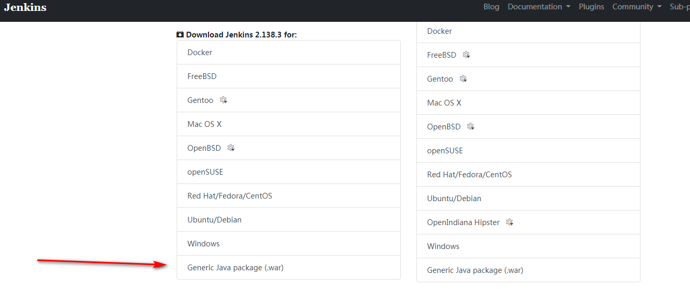
下载下来后进行解压
方法一：直接放到tomcat webapps 直接访问进行解压
方法二：运行java -jar jenkins.war 进行解压
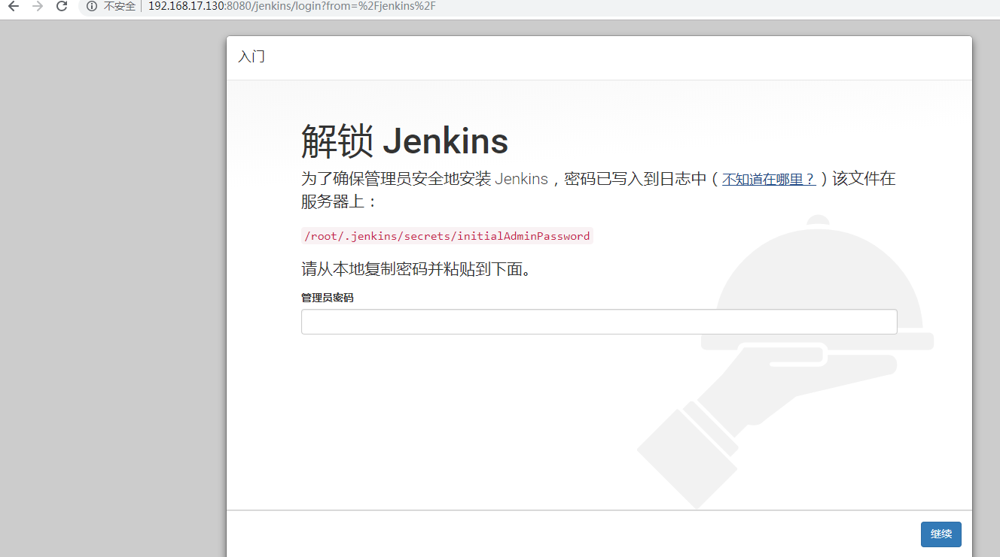
2.查看密码
``` javascript?fancy=2,3&linenums=true
vim  /root/.jenkins/secrets/initialAdminPassword
#查询文件
find / -name [文件名]
```
3.安装
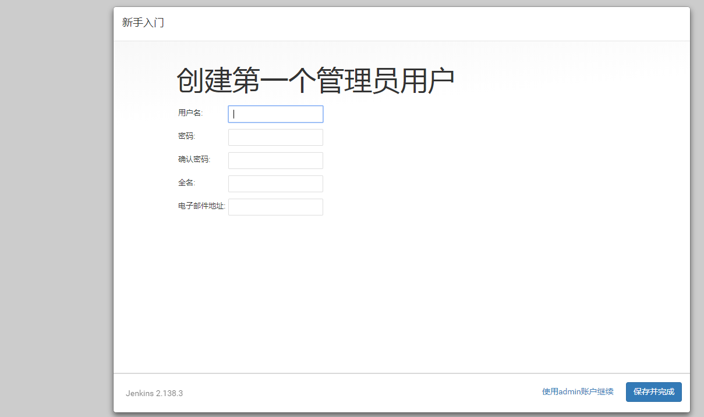
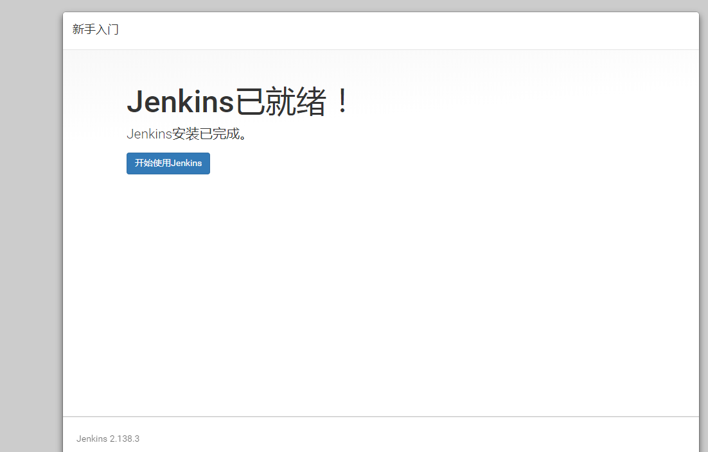
### 开始创建
1.配置jdk,maven
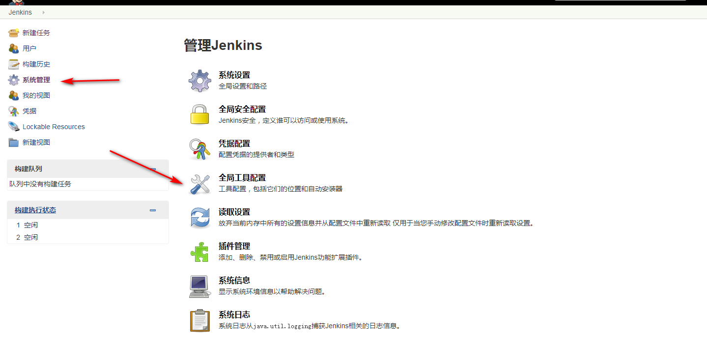
2.安装maven插件
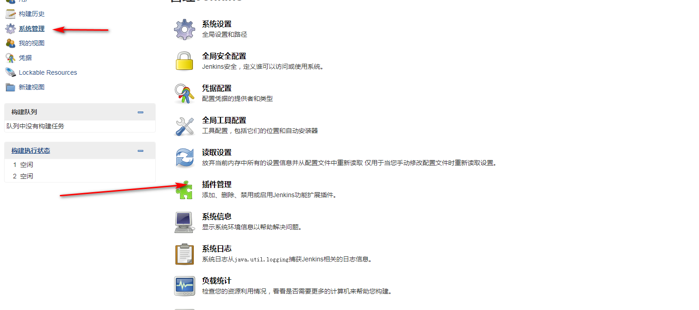
选择可选插件搜索Maven Integration
3.创建项目
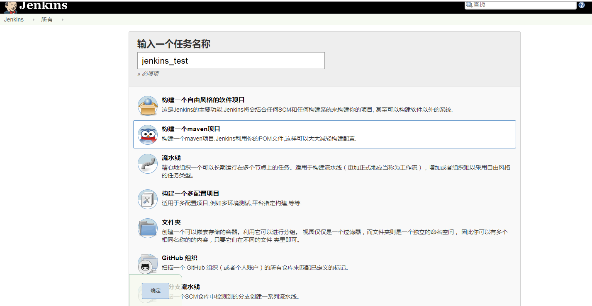
4.设置编译的版本号号等信息
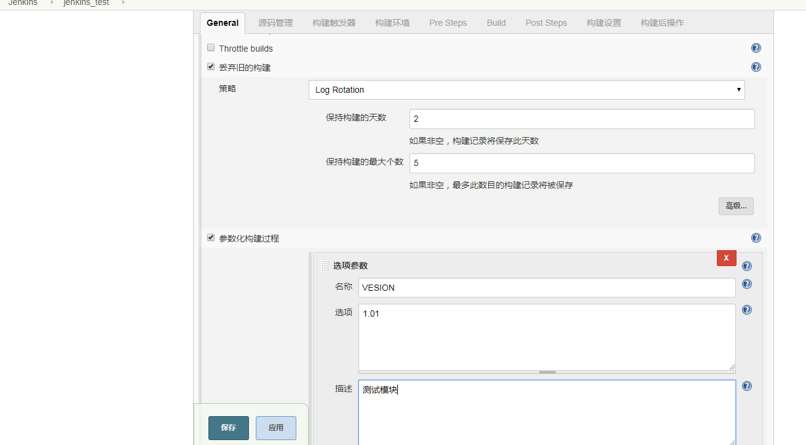
5.设置代码地址
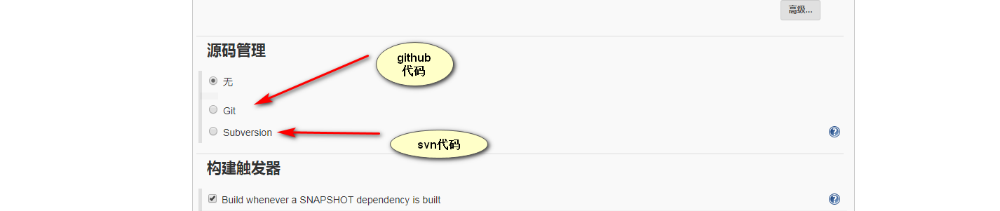
6.开始构建
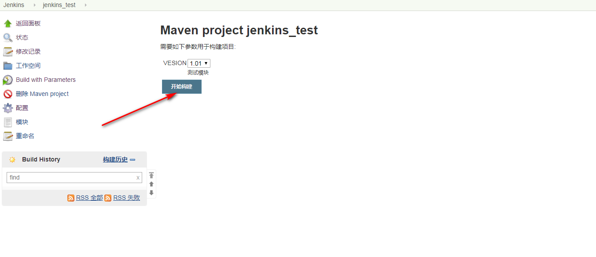
7.版本提交触发构建
``` javascript?fancy=2,3&linenums=true
构建触发器: 只选中 Poll SCM，可指定检查 SVN 代码是否有提交的时间：
H/10  *  *  *  *  ## 任何时候，每隔 30 分钟就检测一次 SVN，如果有提交就启动构建
```
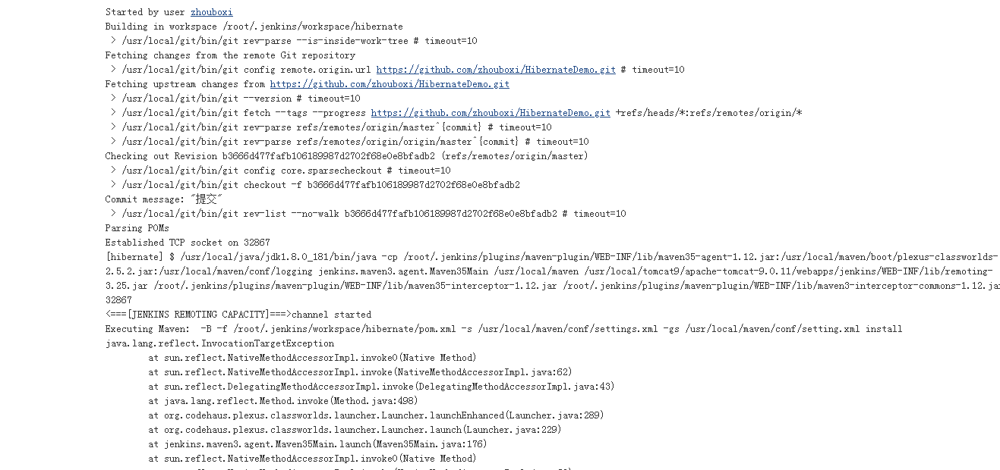
打包失败，问题Jenkins内存溢出
可能因为是虚拟机的限制 暂时无处理方法
问题原因：检查全局配置的maven java配置是否正确
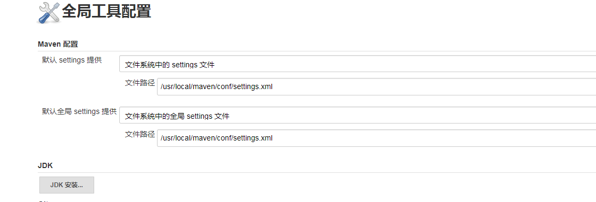
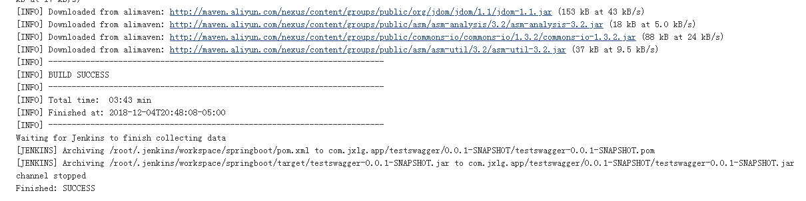