# docker自动化部署实战

本文中使用的是daocloud+coding+docker来实现docker的自动化部署。


### 安装docker(前面我在centos7已经安装了)
``` javascript?fancy=2,3&linenums=true
yum install docker -y
```


### 添加主机 使用daocloud

1.如果没有就去注册一个 
2.地址：https://dashboard.daocloud.io/cluster

3.连接安装提示在你的linux输入对应的命令即可
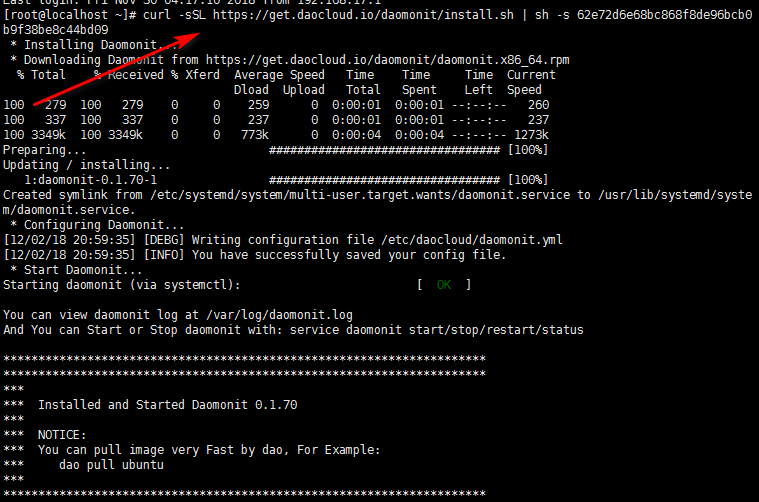

### 上传代码

上面是支持的几种仓库，我这里用Coding
地址：https://coding.net/user
1.新建项目
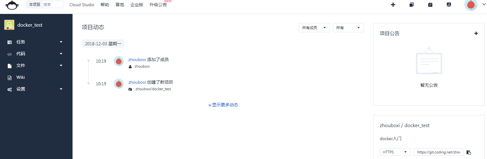
2.上传war包和编写Dockerfile
3.Dockerfile语法地址：
https://www.cnblogs.com/boshen-hzb/p/6400272.html
http://www.cnblogs.com/panwenbin-logs/p/8007348.html
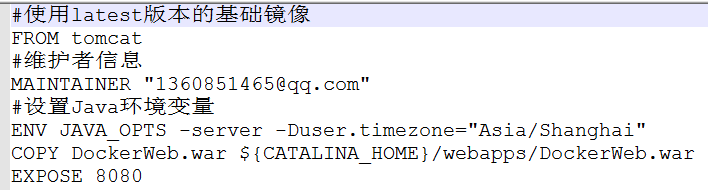
4.上传(Git教材)
1.把war包和Dockerfile放入一个文件夹
2.把文件夹进行初始化 git init
3.把文件添加git暂存取 git add [fileName]
4.把文件提交本地仓库 git commit -m'提交信息'
5.查看文件状态 git status
6.连接你的gitbub或者coding    git remote add origin 地址
7.推送 git push origin master
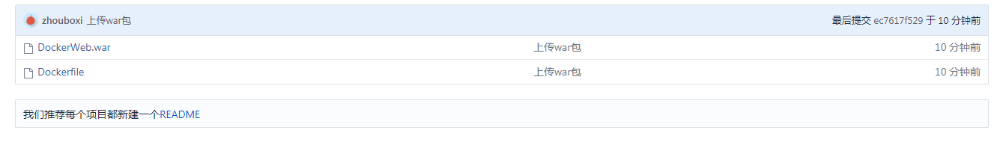
我的地址：https://coding.net/u/zhouboxi/p/docker_test/git
### 创建并部署应用
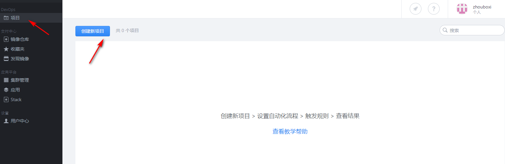
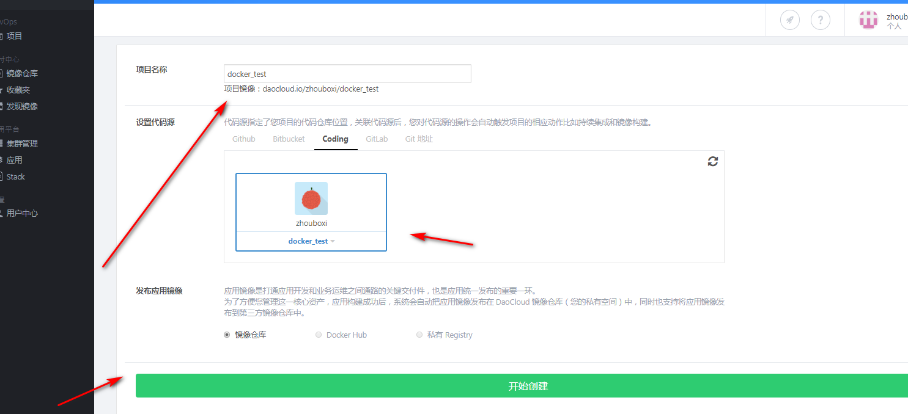
第一次应用创建成功后，需要手动触发。触发以后要记得刷新页面，这时候就会看到构建的镜像了。
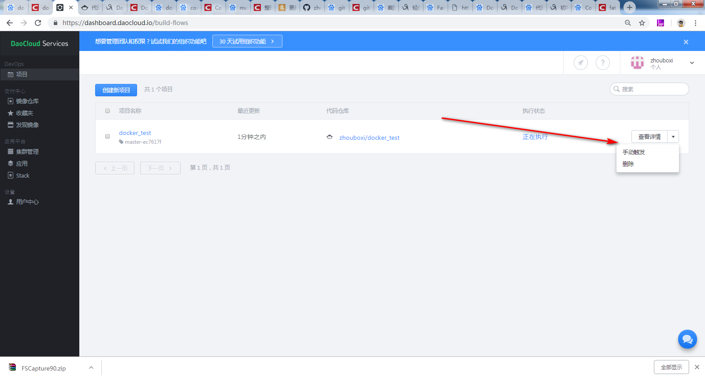
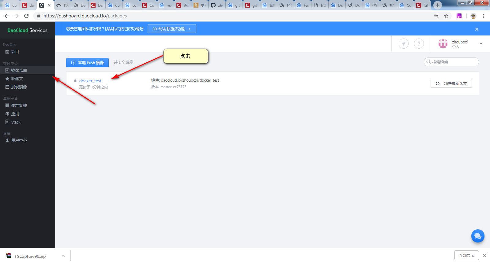
填写应用名，并选择主机，然后最下边点击部署应用程序
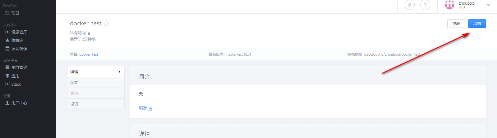
设置端口，dockerfile指定tomcat的端口是8080,80端口是宿主机的端口，到时候我们通过宿主机的ip就可以访问docker的应用了。
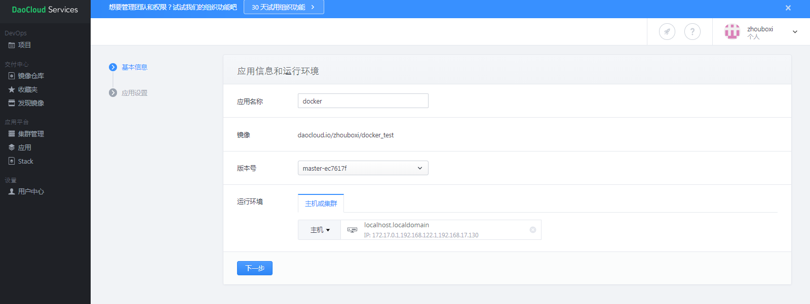
这个自动发布一定要打开，这样下次代码修改后，才会在自动构建镜像后并自动部署应用程序。
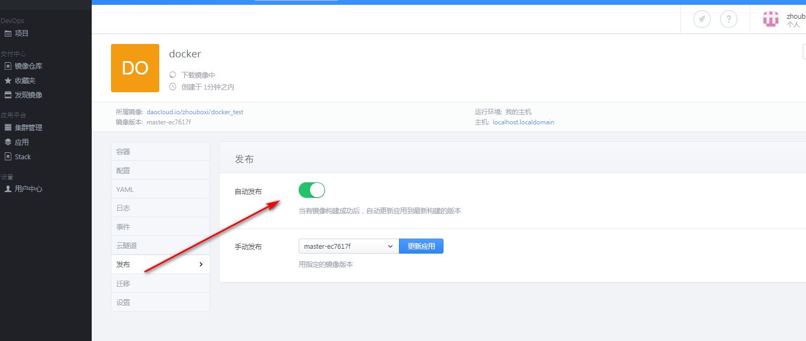
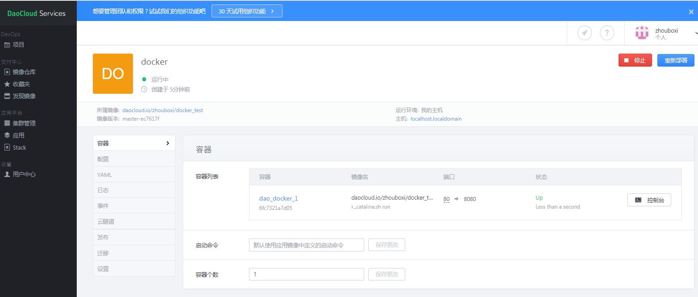
### 访问

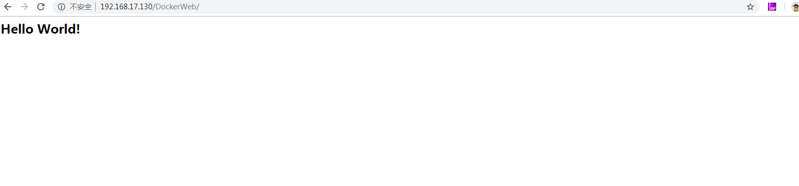